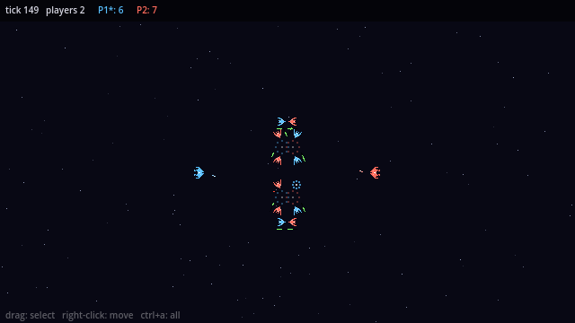

# Spacecraft

A 2D top-down, 16-bit style RTS demo with Galaga-style spacecraft. Godot 4.7 .NET (C#), Windows-only for now.
Multiplayer is 2–4 player P2P lockstep on [Klotho](https://github.com/xpTURN/Klotho) over ENet.



*`just demo 2 -AutoPlay`, host's view, captured with `screenshot=` at tick 149 (640×360, 1:1 pixels).*

## Install

- [`just`](https://github.com/casey/just): `winget install --id Casey.Just -e` (or scoop / choco).
- .NET 8 SDK: `just dotnet-fetch` (winget, machine-wide; skipped when `just dotnet-check` already finds an
  SDK ≥ 8). The Godot .NET editor builds through the `dotnet` on PATH; a runtime alone is not enough.

No other install is required: the `justfile` pins its shell to `powershell.exe`, the Godot editor is a
pinned download (below), and NuGet sources come from the checked-in `nuget.config`.

## Quick start

```powershell
just                 # list every recipe
just godot-fetch     # install the pinned Godot 4.7 .NET editor into .godot-editor/ (gitignored)
just dotnet-fetch    # install the .NET 8 SDK via winget (no-op if `just dotnet-check` already passes)
just build           # compile the C# assembly (runs dotnet-check first)
just demo            # two windows on localhost: click Ready in each
just demo 4 -AutoPlay   # four windows, auto-ready, armies charge the center by themselves
just demo-test 4     # headless 4-peer self-test over loopback ENet, exit 0 on success
just editor          # open the project in the editor
```

`just godot-fetch` is not optional on a fresh clone: the editor is a pinned download rather than a committed
file (see `godot.lock`). Already have a Godot 4.7 **.NET** editor? Set `$env:GODOT_BIN` to its `.exe` and
skip the fetch; a non-.NET build is ignored with a warning. `$env:SPACECRAFT_GODOT_HOME` moves the fetch
location. Add `-Templates` to `godot-fetch` when you need to export.

## Playing

- Drag to box-select your ships, click to pick one, `Ctrl+A` for all, right-click to move. Ships fire on
  their own at enemies in range.
- Each player has the same army: one flagship and eight fighters. Last army standing wins.

## Docs

| Page | Covers |
| --- | --- |
| [docs/netcode.md](docs/netcode.md) | Klotho integration, the ENet transport, sync config |
| [docs/simulation.md](docs/simulation.md) | deterministic ECS: components, systems, army rules |
| [docs/view.md](docs/view.md) | 2D render, sprites, RTS input, HUD |
| [docs/session.md](docs/session.md) | lobby, CLI flags, `just demo` / `demo-test` |

## Conventions

See [CLAUDE.md](CLAUDE.md).
